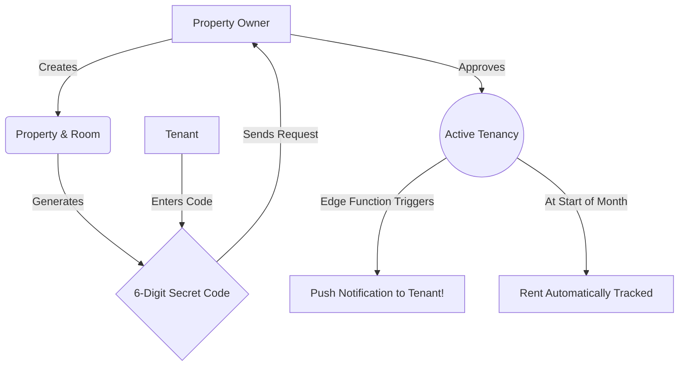

<!-- Header Section with Animated Wave -->

  

<h1>🏢</h1>

  
  
  
  

*The ultimate ecosystem bridging the gap between Property Owners and Tenants with enterprise-level security and real-time syncing.*

## 🌟 Why Rent Collect?
<h2>🚀</h2>

Managing properties and tracking rent shouldn't require manual ledgers, missing WhatsApp messages, and delayed bank statements. **Rent Collect** is designed to completely automate and track the entire lifecycle of a tenancy—from joining a room to paying the final rent bill, seamlessly.

---

## 🏗️ Core Architecture & Features

### 1. 🔐 
We don't just use standard logins. Our security mesh includes:

- **Phone OTP & Biometric Fallbacks**: Frictionless and secure entry.
- **Role-Based Routing**: Intelligent onboarding that adapts the entire UI based on whether you are an Owner or a Tenant.
- **Document Vault**: Fully secure, encrypted storage where tenants can upload PAN/Aadhaar cards for Owner Verification.

 

### 2. ⚡ [)](https://git.io/typing-svg)
Manual pull-to-refresh is a thing of the past:

- **Supabase Edge Functions**: We wrote a custom Deno-based Edge Function that instantly translates database writes into OS-level Push Notifications.
- **Zero-Refresh UI**: The moment an Owner marks rent as "Paid", the Tenant's screen updates instantly via Firebase socket streams.
- **Context-Aware Dashboards**: Tenant dashboards physically transform from "Exploring" to "Waiting" to "Active" based on hidden backend approvals.

 

### 3. 💵 
The crown jewel of the application.

- **Batch Generation**: Owners can tap a single button to generate expected rent records for 500+ tenants simultaneously.
- **Algorithmic Overdue Detection**: Built-in chron-logic parses due dates and visually flags rent as overdue on the dashboards.
- **One-Tap Reminders**: Press a button to ping a tenant's lock screen demanding overdue payments.

  

### 🌊 Flow & Logic

## 🎨 Visual Preview

<b>Click to reveal the power of the UI 📸</b>

 

*We are currently undergoing a massive 3D Glassmorphism UI Revamp. Stay tuned for highly animated, 60fps polished screenshots!*

## 🛠 Develop & Run
<h2>💻</h2>

1. Clone the repository
2. Run `flutter pub get`
3. Link your Supabase CLI for edge functions:  
   `npx supabase link --project-ref gjfunvewcbxpmdfnyunv`
4. Deploy the notification function:  
   `npx supabase functions deploy send-push`
5. Hit `flutter run`!

   
  

